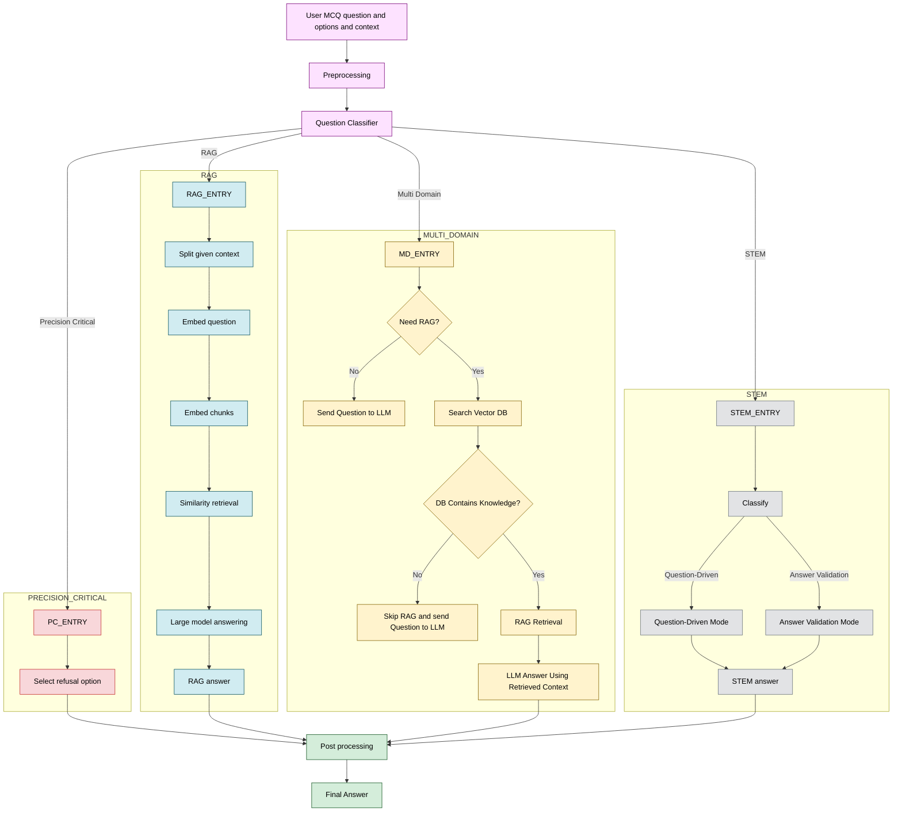

# VNPT AI Hackathon

## Overview
Complete pipeline for processing data, chunking, building a FAISS vector database, and running inference for efficient similarity search. The system specializes in handling multiple-choice questions (MCQs) across domains, with advanced support for STEM (Science, Technology, Engineering, Mathematics) questions using multi-phase reasoning.

## Table of Contents
- [Components](#components)
- [Data Flow](#data-flow)
- [STEM Processing Pipeline](#stem-processing-pipeline)
- [General Pipeline](#general-pipeline)
- [Prerequisites](#prerequisites)
- [Installation](#installation)
- [Usage](#usage)
- [Project Structure](#project-structure)
- [Troubleshooting](#troubleshooting)
- [Contributing](#contributing)
- [License](#license)

## Components
- **Question Classification**: Automatically classify MCQs into labels (e.g., STEM, RAG, Precision-Critical, Multi-Domain) using LLM.
- **LLM with Specialized Roles**:
    - **LLM for RAG**: Retrieval-Augmented Generation for factual questions requiring external knowledge.
    - **LLM for STEM**: Multi-phase reasoning for science/math questions (Question-Driven or Answer-Validation modes).
    - **LLM for Precision-Critical**: Safe handling of sensitive or harmful queries.
    - **LLM for Multi-Domain**: Adaptive processing for general knowledge questions.
- **Answer Extraction LLM**: Post-process raw LLM outputs to extract final answers.
- **RAG System**: FAISS-based vector search for context retrieval.
- **Data Processing**: Chunking, embedding, and indexing for efficient search.

## Data Flow
1. **Input**: Raw MCQ dataset (JSON with qid, question, choices, label).
2. **Classification**: Use LLM to classify questions into labels (STEM, RAG, etc.).
3. **Separation**: Split data by label into separate files.
4. **Inference**:
   - For STEM: Classify mode (Question-Driven/Answer-Validation), apply multi-phase reasoning, fallback if needed.
   - For RAG: Gate decision for retrieval, retrieve context, generate answer.
   - For others: Direct LLM prediction.
5. **Post-Processing**: Extract answer letters (A/B/C/...), handle errors.
6. **Output**: CSV with qid and predicted answer.

## General Pipeline


## STEM Processing Pipeline

The STEM module (`stem_solver/`) handles questions in Science, Technology, Engineering, and Mathematics (STEM), using structured multi-phase reasoning to ensure **high accuracy** and reduce errors.

### Key Features
- **Mode Classification**: Automatically determines if the question is:
  - **Question-Driven** – solve independently of the choices, then compare with choices.
  - **Answer-Validation (Choice-Driven)** – solve while **considering each choice as a hypothesis**.
- **Multi-Phase Reasoning**: Breaks down solving into phases for clarity and verification.
- **Fallback Mechanism**: Activated when the model's generated result does not match any of the given choices. This usually indicates that the model could not extract some hidden knowledge needed for calculation, or the problem is missing necessary data.
- **Robustness**: Handles retries, JSON parsing, and edge cases (e.g., approximations, rounding).

### Detailed Flow

#### 1. Input Preparation
- Receive question, choices, and mode ("strict" or "allow_no_answer").
- Initialize 4 LLM instances: Classifier, Question-Driven, Choice-Driven, Second-Think.

#### 2. Mode Classification
- Use `STEM_CLASSIFY_PROMPT` to classify into `"QUESTION_DRIVEN"` or `"ANSWER_VALIDATION"`.
- Output: JSON with `analysis_mode`.

#### 3. Reasoning by Mode

##### Question-Driven Mode (`STEM_PROMPT_QUESTION_DRIVEN`)
- **PHASE_1**: Analyze requirements, explicit/implicit data, and solution strategy.
- **PHASE_2**: Solve step-by-step (`solution_steps` and `final_result` for the final computed result).
- **PHASE_3**: Compare result with choices to determine match (`has_result`), ensuring compatibility with unit differences, alternative representations, approximate values/rounding, or equivalent expressions.
- **PHASE_4**: Select final answer corresponding to one of the choices (`A/B/C/...` or `"X"` if no match).

##### Answer-Validation Mode (Choice-Driven) (`STEM_PROMPT_ANSWER_VALIDATION`)
- **PHASE_1**: Identify question type, evaluation criteria, and list all required knowledge, formulas, laws, or models needed to reason about the problem.
- **PHASE_2**: For **each choice**:
  - Assume the choice is correct.
  - Perform all necessary calculations, reasoning, or simulations based on PHASE_1.
  - Include approximations, unit conversions, or equivalent representations if needed.
  - Write all steps explicitly and output a **final result or logical conclusion** for the choice (without comparing to other choices yet).
- **PHASE_3**: Validate each choice by checking if the result from PHASE_2 satisfies the criteria from PHASE_1.
  - Analyze each choice independently.
  - Evaluate its compatibility with the problem and reasoning.
- **PHASE_4**: Select the choice that best fits the problem.
  - Output the **letter corresponding to the choice**.
  - If no choice is clearly correct, return `"X"`.

#### 4. Fallback / Second-Think
- Can only be activated when set `mode = 'strict'`, meaning the final answer must match one of the given choices. 
- Use `STEM_SECOND_THINK` for assumption-based reasoning if Question-Driven solving fails. This is typically activated when the model's generated result does not match any of the given choices, indicating that the model could not extract hidden knowledge or the problem lacks necessary data, leads to false result. In this phase, each choice is treated as a hypothesis, reasonable assumptions are made, and calculations or reasoning are repeated to select the choice most consistent with the problem and assumptions.
- **PHASE_1**: Re-analyze the requirements, constraints, and relevant knowledge.
- **PHASE_2**: For each choice, assume it is correct, propose reasonable assumptions, and re-solve the problem using calculations or logical reasoning.
- **PHASE_3**: Evaluate the reasonableness and consistency of the assumptions for each choice.
- **PHASE_4**: Select the answer corresponding to the choice with the most reasonable assumptions.


#### 5. Post-Processing
- Parse JSON output, extract `final_answer`.
- Retry on errors (up to `max_retries`).
- Return answer letter or `"X"` if unresolved.

### Prompts Used
- `STEM_CLASSIFY_PROMPT`: Mode selection
- `STEM_PROMPT_QUESTION_DRIVEN`: 4-phase independent solving
- `STEM_PROMPT_ANSWER_VALIDATION`: 4-phase choice-driven solving
- `STEM_SECOND_THINK`: 4-phase fallback with assumption reasoning

### Notes
- This pipeline ensures high accuracy by mimicking structured, human-like expert reasoning.

## Reference_data

## Data Collection & Processing
We used five external datasets to build the RAG vector search layer:
1. Civic Knowledge: data built from Vietnamese central government resolutions (2022–2025).
2. Ho Chi Minh: data extracted from Wikipedia documents related to Hồ Chí Minh President.
3. Law: data from Hugging Face – VTSNLP/base_vbpl_full (135k legal documents).
4. Medical: data from Hugging Face – VTSNLP/base_yTe (65.2k medical documents).
5. Political Science: lecture materials from the “General Political Theory” course of Thai Nguyen University.

The datasets were not merged into a single structure. Only the text field was extracted from each dataset for processing.
All extracted texts were cleaned and chunked, then transformed into embedding vectors.
Each dataset was indexed independently using Faiss IndexFlatIP, because the overall data volume is very large and this index type provides efficient and scalable vector similarity search.

**Final result:** five separate Faiss IndexFlatIP databases (civic knowledge, Hồ Chí Minh, law, medical, political science) ready for retrieval in the RAG system.
## Prerequisites
- Python 3.8+
- pip (or conda)
- Bash shell
- Recommended: 2GB+ free disk for indexes

## Installation
```bash
git clone <repository-url>
cd VNPT_AI_Hackathon
python -m venv venv
source venv/bin/activate  # On Windows: venv\Scripts\activate
pip install -r requirements.txt
```

## Usage
1) Chunk raw data
```bash
bash scripts/chunk.sh
```
2) Build FAISS index
```bash
bash scripts/faiss.sh
```
3) Run inference
```bash
bash scripts/inference.sh
```

## Project Structure
```
VNPT_AI_Hackathon/
├── scripts/
│   ├── chunk.sh       # Data chunking
│   ├── faiss.sh       # Build FAISS index
│   └── inference.sh   # Run inference pipeline
├── data/              # Raw and processed data
├── models/            # Model artifacts
├── src/               # Source code
├── requirements.txt
└── README.md
```

## Troubleshooting
- Ensure virtual environment is activated before running scripts.
- Verify input data paths expected by `chunk.sh`.
- If FAISS build fails, check that system BLAS/FAISS dependencies are installed.

## Contributing
Issues and PRs are welcome. Please include concise descriptions and tests where applicable.

## License
Specify your license (e.g., MIT) in this section.